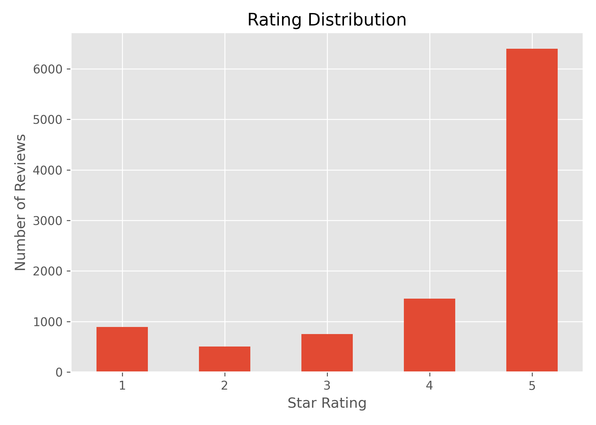
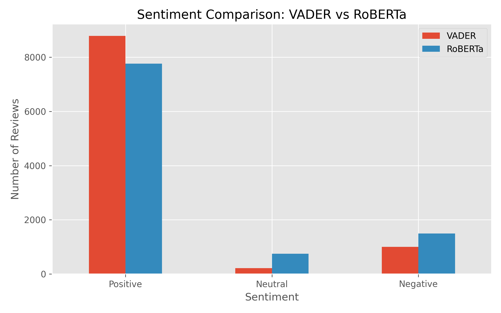

# Amazon Fine Food Reviews Sentiment Analysis | VADER + RoBERTa NLP Pipeline

Comparing lexicon-based and transformer-based sentiment analysis on real customer reviews to uncover patterns ratings alone don't show.

---

## Overview

Customer reviews carry rich signals about product quality, customer satisfaction, and user experience. However, manually analyzing thousands of reviews does not scale.

This project builds an NLP pipeline to analyze Amazon Fine Food Reviews and classify sentiment using two different approaches:

- **VADER** — a lexicon-based sentiment analyzer that is fast, interpretable, and effective for sentiment scoring
- **RoBERTa** — a pretrained transformer model that captures contextual meaning and relationships between words

The goal is to compare both approaches and identify cases where star ratings and written customer feedback tell different stories.

---

# Business Problem

E-commerce platforms receive millions of customer reviews. Extracting actionable insights from this unstructured feedback helps businesses:

- Measure customer satisfaction at scale
- Identify recurring product issues
- Detect hidden dissatisfaction inside positive ratings
- Improve product quality and customer experience decisions

---

# Dataset

**Amazon Fine Food Reviews Dataset (Kaggle)**

The original dataset contains:

- 568,454 customer reviews
- Product ratings
- Review text
- Helpfulness votes
- User and product metadata

## Sampling Approach

The original dataset contains over 568K reviews. Due to the computational cost of transformer-based NLP models, a random sample of **10,000 reviews** was selected for analysis.

This provided:

- Sufficient data diversity for sentiment analysis
- Faster experimentation and iteration
- Practical scalability considerations for real-world NLP workflows

---

# Tech Stack

| Category | Tools |
|---|---|
| Language | Python |
| Data Handling | Pandas, NumPy |
| Visualization | Matplotlib, Seaborn |
| NLP | NLTK, VADER, Hugging Face Transformers, RoBERTa |
| Deep Learning | PyTorch |
| Environment | Jupyter Notebook |

---

# Workflow

## 1. Data Loading & Sampling

- Loaded the Amazon Fine Food Reviews dataset
- Analyzed dataset structure and statistics
- Selected a representative sample of 10,000 reviews

---

## 2. Exploratory Data Analysis

Performed analysis on:

- Rating distribution
- Review length patterns
- Helpfulness trends
- Customer feedback characteristics

---

## 3. Text Processing

Performed:

- Text extraction
- Tokenization
- Transformer input formatting
- Text length analysis

---

## 4. Sentiment Scoring

### VADER Sentiment Analysis

VADER generates:

- Positive sentiment score
- Neutral sentiment score
- Negative sentiment score
- Compound sentiment score

Advantages:

- Fast execution
- Easy interpretation
- Suitable for large-scale sentiment scoring

---

### RoBERTa Transformer Analysis

A pretrained RoBERTa transformer model was used to perform contextual sentiment classification.

Unlike lexicon-based methods, RoBERTa understands:

- Context
- Word relationships
- Sentence meaning

The model generates probabilities for:

- Negative sentiment
- Neutral sentiment
- Positive sentiment

---

# Comparative Analysis

The project compares:

- VADER vs RoBERTa sentiment predictions
- Model agreement and disagreement
- Star ratings vs AI-predicted sentiment
- Review length across sentiment categories
- Sentiment vs helpfulness votes

---

# Key Insights

*(Final numbers will be updated after analysis completion)*

Expected analysis includes:

- Overall sentiment distribution
- Rating distribution patterns
- Cases where AI sentiment differs from star ratings
- Review length differences between positive and negative feedback
- Common themes from dissatisfied customers

---

# Results

*(To be updated after final analysis)*

Example metrics:

- VADER classified X% reviews as positive, X% neutral, and X% negative.
- RoBERTa identified X% positive, X% neutral, and X% negative sentiment.
- X% of reviews showed disagreement between star ratings and AI sentiment.
- Negative reviews had an average length of X characters compared to X characters for positive reviews.

---

# Business Recommendations

Based on sentiment analysis:

- Monitor negative sentiment trends to identify recurring customer issues
- Use NLP-based classification to automatically categorize customer feedback
- Prioritize improvements based on frequently mentioned problems
- Combine star ratings with text sentiment for a complete customer experience view

---

# Visualizations

### Rating Distribution

### VADER vs RoBERTa Sentiment Comparison

### Review Length Analysis

---

# Project Highlights

- Processed and analyzed 10,000 real customer reviews
- Built an NLP pipeline combining traditional and transformer-based sentiment analysis
- Compared VADER and RoBERTa predictions
- Identified rating and sentiment mismatches
- Converted unstructured customer feedback into actionable insights

---

# Future Improvements

- Build an automated sentiment dashboard using Power BI
- Apply topic modeling to categorize complaint themes
- Develop a real-time review monitoring pipeline
- Fine-tune RoBERTa on food and retail-specific review data

---

# Repository Structure
